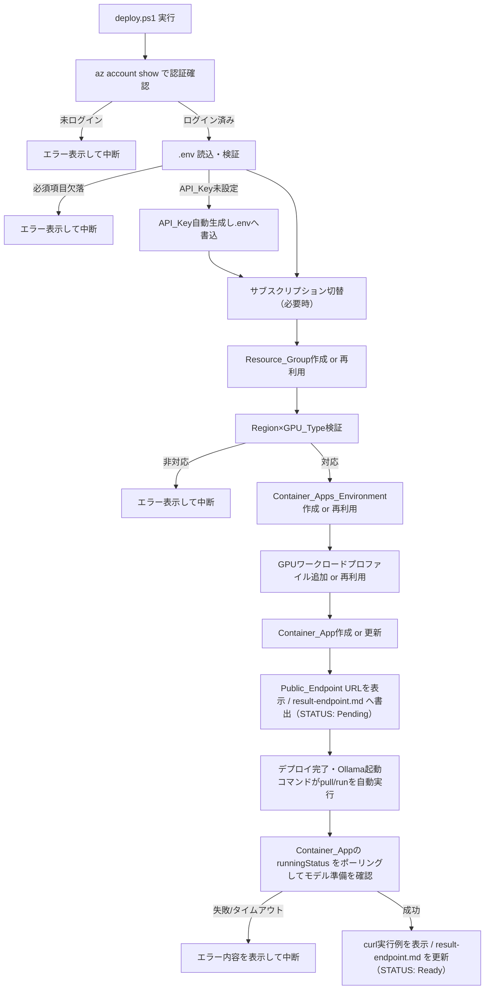
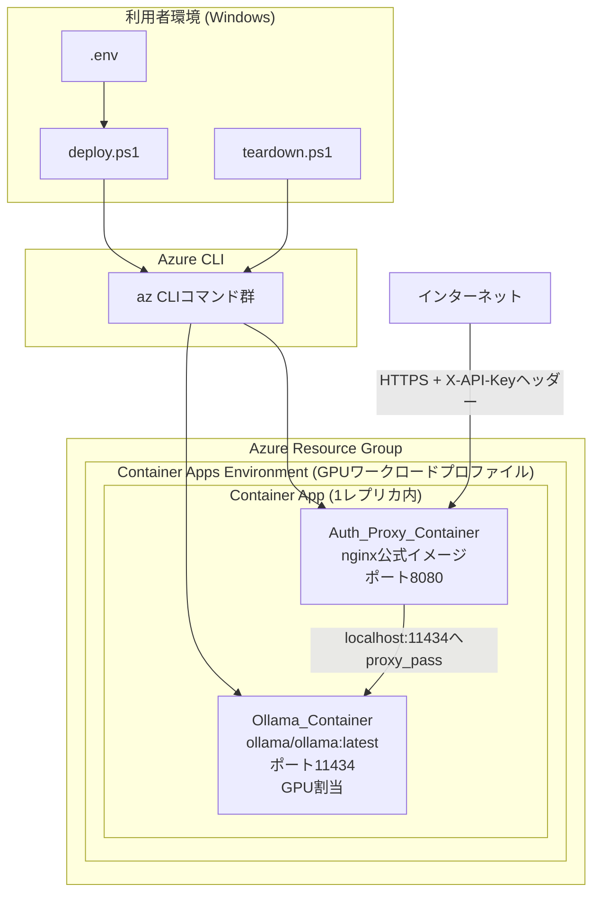

# Design Document

## Overview

本設計は、Azure Container Apps のサーバーレス GPU 機能上に Ollama コンテナと nginx 認証プロキシのサイドカーを配置し、`gpt-oss:20b` モデルを APIキー付きでインターネットに公開する一連の自動化を実現する。利用者は `.env` に設定値を記入し、1本の PowerShell デプロイスクリプト (`deploy.ps1`) を実行するだけで、リソースグループ作成からモデルのロード、公開URLの表示までを完了できる。逆方向の `teardown.ps1` により作成済みリソースを削除できる。

### スクリプト言語の選定: PowerShell

ユーザーの主な実行環境は Windows (PowerShell/CMD) であるため、以下の理由から **PowerShell (.ps1)** をデプロイ/クリーンアップスクリプトの実装言語として採用する。

| 観点 | PowerShell | Bash |
|---|---|---|
| Windows 標準搭載 | ◎ (Windows 10/11に標準搭載、追加インストール不要) | △ (WSL または Git Bash が別途必要) |
| Azure CLI との親和性 | ◎ (`az` はどちらからも同一コマンドで呼び出し可能。JSON出力を`ConvertFrom-Json`でネイティブに扱える) | ○ (`jq`等の追加ツールが必要になりがち) |
| クロスプラットフォーム | ○ (PowerShell 7+ は Windows/macOS/Linuxで動作) | ◎ (Linux/macOSではデフォルト) |
| 利用者の追加セットアップ | 不要 | WSL/Git Bash導入が必要 |

Windows環境を主な実行環境と想定する本プロジェクトでは、追加のランタイム導入が不要な PowerShell を採用することで、事前準備の手間を最小化する。なお、コンテナ内部（Ollama_Container・Auth_Proxy_Containerの起動コマンド）は Linux コンテナ上で実行されるため、こちらは `sh`/`bash` で記述する（ホストのスクリプト言語とは独立)。将来的にBash版デプロイスクリプトを追加することも可能だが、本設計のスコープ外とする。

### 全体フロー



## Architecture

### コンポーネント構成



Container Apps の仕様上、同一 Container App 内の複数コンテナは同一のネットワーク名前空間（同一レプリカ内で `localhost` 通信可能）を共有する。したがって Auth_Proxy_Container は `http://localhost:11434` で Ollama_Container にリクエストを転送できる。イングレスのターゲットポートは Auth_Proxy_Container が待ち受けるポート（8080）に設定し、Ollama_Container の11434ポートは外部に直接公開しない。

GPUはコンテナ単位ではなくワークロードプロファイル単位で割り当てられる。Container Apps の仕様上、1つのアプリ内で複数コンテナがある場合、最初に定義されたコンテナがGPUへのアクセス権を得る。そのため `properties.template.containers` 配列で Ollama_Container を先頭に定義する。

### Azure CLIコマンドのシーケンス（Deployment_Script）

1. `az account show` — 認証済みセッションの確認（失敗時は中断）
2. `az account show --query id` と `.env` の `AZURE_SUBSCRIPTION_ID` を比較し、不一致なら `az account set --subscription <id>` で自動切替
3. `az group create --name <rg> --location <location>` — 既存の場合も冪等に成功する（Azure CLI自体が冪等）
4. `az containerapp env show` で存在確認 → 存在しなければ `az containerapp env create`
5. GPU_Typeから導出したワークロードプロファイルタイプ（`Consumption-GPU-NC8as-T4` または `Consumption-GPU-NC24-A100`）を `az containerapp env workload-profile add` で環境に追加する。ただし実機検証により、`workload-profile add` は**冪等ではなく**、同名プロファイルが既に存在する場合は "Cannot add workload profile ... because it already exists" エラーで失敗することが判明したため、事前に `az containerapp env show` の `properties.workloadProfiles` を確認し、**既存の場合はコマンド自体をスキップして再利用**する。また、`Consumption-GPU-*`（Consumptionプラン）は専用プラン用のノード数指定（`--min-nodes`/`--max-nodes`）を受け付けない（"WorkloadProfilePropertyNotSupported"）ため、これらは指定しない。
6. `az containerapp env show --query id` で Container_Apps_Environment のリソースID（`environmentId`）を取得したうえで、`az containerapp show` で Container App の存在確認を行い、`ContainerAppSpec.psm1` の `New-ContainerAppSpec` が返すリソース定義（hashtable）を `ConvertTo-Json` でJSON化し、**`az rest --method PUT --uri <ARM URI> --body @<一時JSONファイル>` でAzure Resource Manager REST API（`Microsoft.App/containerApps`, api-version `2024-03-01`）を直接呼び出して作成/更新する**。新規作成の失敗時はエラー表示して中断し、既存更新の失敗時はログに記録して後続手順を継続する。
   - 注: 当初は `az containerapp create/update --yaml`（`New-ContainerAppYaml`が生成するYAML）を用いる設計だったが、実機検証により `az`（v2.87.0）の内部YAML→JSON変換に不具合があり、正しい構造のYAMLでも "Bad Request: The JSON value could not be converted to System.Boolean" エラーで必ず失敗することが判明した。同一内容のJSONを `az rest` で直接送信すると成功するため、`--yaml` 方式を廃し `az rest` 方式へ変更した。`New-ContainerAppYaml` は後方互換・テスト用として残置するが、`deploy.ps1` の実処理では使用しない。
7. `az containerapp show --query properties.configuration.ingress.fqdn` で Public_Endpoint のURLを取得し表示する。`az rest` による作成直後は結果整合性（eventual consistency）でFQDNが空文字列で返ることがあるため、短間隔で数回リトライする。取得したURL・API_Key・モデル名は `result-endpoint.md` に書き出す（この時点では `STATUS: Pending`）。
8. `az containerapp show --query properties.runningStatus` を一定間隔でポーリングし、状態文字列（`Running`→準備完了、`Failed`/`Degraded`→失敗）を `DeploymentMonitor.psm1` の `Get-ModelReadinessResult` で判定する。Ollama_Container起動コマンド内の `ollama pull` が失敗するとレプリカが起動失敗/再起動を繰り返し `runningStatus` に反映される。失敗またはタイムアウト時はエラー表示して中断する。（当初設計の `az containerapp logs show` によるログ監視ではなく `runningStatus` 監視を採用した。）
9. 成功時、APIキーとURLを使ったcurl実行例を表示し、`result-endpoint.md` を完了状態（`STATUS: Ready`、curl実行例を含む）で更新する。この `result-endpoint.md` は同梱のPythonチャットクライアント `chat.py` が参照する。

### GPUワークロードプロファイルのマッピング

| GPU_Type | ワークロードプロファイルタイプ | vCPU/メモリ上限 |
|---|---|---|
| `T4` | `Consumption-GPU-NC8as-T4` | 8 vCPU / 56 GiB |
| `A100` | `Consumption-GPU-NC24-A100` | 24 vCPU / 220 GiB |

対応リージョンは `westus3` と `swedencentral` の2つのみを本プロジェクトの選択肢とする（要件の決定事項どおり、両リージョンともT4/A100の両方に対応）。

## Components and Interfaces

### 1. `.env` パーサー / バリデーター (`EnvFile.psm1`)

- `Read-EnvFile([string]$Path) -> hashtable`: `KEY=VALUE` 形式の行を解析し、コメント行（`#`始まり）・空行を無視し、引用符（`"`/`'`）を除去してハッシュテーブルを返す純粋関数。
- `Write-EnvFile([string]$Path, [hashtable]$Values)`: ハッシュテーブルを `.env` 形式の文字列に整形してファイルへ書き込む。既存のコメント構造は保持せず、キー=値の行のみを出力する（`.env.example` のコメントは別ファイルとして維持）。
- `Test-RequiredKeys([hashtable]$Values, [string[]]$RequiredKeys) -> [string[]]`: 欠落しているキー名の配列を返す純粋関数（空配列なら検証OK）。
- `New-ApiKey([int]$Length = 32) -> string`: 暗号論的乱数を用いて英数字のランダム文字列を生成する純粋関数。

### 2. リソース冪等性判定 (`ResourceState.psm1`)

- `Get-ResourceAction([bool]$Exists) -> string`: `Exists`が`$true`なら`"Reuse"`、`$false`なら`"Create"`を返す純粋関数。Resource_Group、Container_Apps_Environment、ワークロードプロファイルの存在チェック結果に共通して用いる。
- `Test-RegionGpuSupported([string]$Region, [string]$GpuType) -> bool`: `{westus3, swedencentral} × {T4, A100}` の許可リストとの一致を判定する純粋関数。

### 3. GPUマッピング (`GpuProfile.psm1`)

- `Get-WorkloadProfile([string]$GpuType) -> @{ProfileType; FriendlyName; MaxCpu; MaxMemoryGiB}`: GPU_Typeからワークロードプロファイル定義を返す純粋関数（上表のマッピング）。

### 4. Container App スペック生成 (`ContainerAppSpec.psm1`)

- `New-ContainerAppSpec([hashtable]$Config, [string]$Location) -> hashtable`: **`deploy.ps1` が実際に使用する関数。** `.env`設定値から、ARM REST API（`az rest --method PUT`）へ送るContainer Appリソース定義を、ネスト済みhashtableとして返す純粋関数。呼び出し元は `ConvertTo-Json -Depth 20` でJSON化して送信する。以下を必ず含む：
  - `location`: `.env`の`AZURE_LOCATION`（ARMリクエストボディ直下に必要）
  - `properties.environmentId`: Container_Apps_EnvironmentのリソースID（`Config.EnvironmentId`）。実機検証により `create` 時に必須であることが判明したため必ず含める（プロパティ名は `managedEnvironmentId` ではなく `environmentId`）。
  - `properties.workloadProfileName`: GPUマッピングで得たフレンドリー名
  - `properties.template.containers[0]`: Ollama_Container（`image: docker.io/ollama/ollama:latest`、`command: ["sh","-c"]` + `args: [<起動スクリプト本体>]`、環境変数 `OLLAMA_MODEL`、resources）
  - `properties.template.containers[1]`: Auth_Proxy_Container（`image: nginx:alpine`、`command: ["sh","-c"]` + `args: [<nginx設定注入スクリプト本体>]`、環境変数 `API_KEY`（secretRef）、resources）
  - `properties.configuration.ingress`: `external: true`, `targetPort: 8080`（Auth_Proxy_Containerのポート。11434は使用しない）, `transport: Auto`
  - `properties.configuration.secrets`: `api-key` シークレット（値は`Config.ApiKey`）
  - `properties.template.scale`: `minReplicas: 0`, `maxReplicas: 1`
- `New-ContainerAppYaml([hashtable]$Config) -> string`: `.env`設定値から `az containerapp create/update --yaml` 相当のYAML文字列を生成する純粋関数。**後方互換・テスト用として残置しているが、`deploy.ps1` の実処理では使用しない**（`az` の `--yaml` 処理の不具合を回避するため `New-ContainerAppSpec` + `az rest` 方式へ移行した。「Azure CLIコマンドのシーケンス」手順6の注を参照）。生成内容（コンテナ構成・イングレス等）は `New-ContainerAppSpec` と同一。

### 5. Nginx設定生成 (`NginxConfig.psm1`)

- `New-NginxConfigScript([string]$ApiKey) -> string`: Auth_Proxy_Containerの起動コマンド文字列（shスクリプト**本体**）を生成する純粋関数。生成されるシェルスクリプトは、ヒアドキュメント（引用符付き終端子 `<<'EOF'`）でAPIキー値をリテラルとして埋め込んだ `nginx.conf` を作成し、`nginx -g "daemon off;"` を実行する。

  実装上の注意（実機検証で判明した設計変更）:
  - この関数は **`sh -c '...'` ラッパーを含まないスクリプト本体のみ**を返す。呼び出し元（`ContainerAppSpec.psm1`）が `command: ["sh","-c"]` + `args: [<本体>]` として設定することで `sh -c` が1回だけ適用される。以前は関数自体が `sh -c '...'` を返しており、`command` の `sh -c` と二重にネストしてコンテナがクラッシュループする不具合があったため変更した。
  - PowerShellのヒアストリングはWindows上でCRLF改行を生成するため、Linuxコンテナに渡す前にLF（`\n`）のみへ正規化し、末尾改行を除去する。
  - APIキーはヒアドキュメントにリテラル埋め込みするため **`envsubst` や実行時の環境変数展開には依存しない**（純粋関数として同一入力から同一出力）。

nginx設定の骨子（生成される`nginx.conf`の内容イメージ、`${API_KEY}`はスクリプト実行時に実際の値へ展開される）:

```nginx
server {
    listen 8080;
    location / {
        if ($http_x_api_key = "") {
            return 401;
        }
        if ($http_x_api_key != "${API_KEY}") {
            return 401;
        }
        proxy_pass http://localhost:11434;
        proxy_set_header Host $host;
    }
}
```

`New-NginxConfigScript` が返す文字列の実体（`sh -c` ラッパーを含まないスクリプト本体。APIキー値はヒアドキュメントへリテラル埋め込み済み）:

```sh
cat <<'EOF' > /etc/nginx/conf.d/default.conf
server {
    listen 8080;
    location / {
        if ($http_x_api_key = "") { return 401; }
        if ($http_x_api_key != "<APIキー値がリテラル埋め込みされる>") { return 401; }
        proxy_pass http://localhost:11434;
        proxy_set_header Host $host;
    }
}
EOF
nginx -g "daemon off;"
```

引用符付き終端子 `<<'EOF'` によりヒアドキュメント本体はシェル展開されず、`$http_x_api_key`・`$host` は nginx 変数としてそのまま書き込まれる。APIキー値は生成時にリテラルとして埋め込まれるため、コンテナ起動時点で完成した `nginx.conf` でnginxが起動する。これにより実行時の動的な文字列比較ロジック（njs等）や `envsubst` を必要としない。

### 6. 認可判定ロジック (`AuthDecision.psm1`) — テスト用の純粋関数モデル

nginx設定自体はAzure上で動作するため直接ユニットテストできないが、その判定ロジック（「ヘッダー値が設定キーと完全一致する場合のみ許可」）をPowerShell側でも純粋関数としてモデル化し、設計の正しさを検証する:

- `Test-ApiKeyAuthorized([string]$HeaderValue, [string]$ConfiguredKey) -> bool`: `$HeaderValue`が`$null`または空文字列なら`$false`、`$ConfiguredKey`と完全一致する場合のみ`$true`を返す。

### 7. Ollama起動スクリプト生成 (`OllamaStartup.psm1`)

- `New-OllamaStartupScript([string]$ModelName) -> string`: Ollama_Containerの起動コマンド文字列（**`sh -c` ラッパーを含まないスクリプト本体**）を生成する純粋関数。モデル名（`$ModelName`）はリテラルとして埋め込まれる。生成される内容は概ね以下の順序を守る:

```sh
ollama serve &
until ollama list >/dev/null 2>&1; do sleep 2; done
ollama pull "<モデル名がリテラル埋め込みされる>" || exit 1
echo "" | ollama run "<モデル名>" >/tmp/ollama-run.log 2>&1
wait
```

`ollama serve` をバックグラウンドで起動し、ヘルスチェックループでAPIが応答可能になるのを待ってから `ollama pull` を実行、成功後に `ollama run` で明示的にモデルをGPUメモリへロードする。`ollama pull` が失敗した場合はプロセスが終了コード1で終了し、Container Apps 上でレプリカの再起動やプロビジョニング失敗として観測できる。

実装上の注意（実機検証で判明した設計変更）:
- **ヘルスチェックは `curl` ではなく `ollama list`** を用いる。公式 `ollama/ollama` イメージには `curl` が同梱されておらず、`curl` によるヘルスチェックは "command not found" で常に失敗し `ollama pull` に到達できない（既知の問題: ollama/ollama#9781）。
- `New-NginxConfigScript` と同様、この関数は **`sh -c` ラッパーを含まないスクリプト本体のみ**を返し（`sh -c` の二重ネスト回避）、CRLF→LF正規化と末尾改行除去を行う。

### 8. デプロイ後のモデル準備確認 (`DeploymentMonitor.psm1`)

- `Get-ModelReadinessResult([string]$State) -> string`: `$State`（`"Succeeded"`, `"Failed"`, `"Timeout"`, `"Pulling"`等のシミュレーション用文字列）を受け取り、`"Failed"`または`"Timeout"`のときは常に`"Error"`を、`"Succeeded"`のとき`"Ready"`を、それ以外は`"Pending"`を返す決定関数。実運用では、`deploy.ps1` の `Wait-ForModelReady` が `az containerapp show --query properties.runningStatus` の値（`Running`/`Failed`/`Degraded`）をこの関数の状態区分（`Succeeded`/`Failed`/`Pulling`）へ写像して判定に用いる（当初設計の `az containerapp logs show` 監視ではなく `runningStatus` 監視を採用）。
- `Write-DeploymentResult([bool]$IsComplete, [string]$Url, [string]$ApiKey)`: `$IsComplete`が`$true`の場合のみcurl実行例を出力し、常に（完了前でも）Public_EndpointのURL自体は別ステップ（Container_App作成完了時点）で出力する。この2つの出力タイミングの違いは要件3.5と6.2の違いに対応する。curl実行例はWindows PowerShellでそのまま実行できる形式（`curl.exe` を明示、JSON本体の `"` を `\"` にエスケープ、`"stream":false` を付与）で出力する。
- `Write-ResultEndpointFile([string]$Url, [string]$ApiKey, [string]$ModelName, [bool]$IsComplete, [string]$Path)`: Public_EndpointのURL・API_Key・モデル名・STATUS（`$IsComplete`が`$true`なら`Ready`、`$false`なら`Pending`）をMarkdown（`result-endpoint.md`）へ書き出す。`$IsComplete`が`$true`のときは上記と同形式のcurl実行例（コードフェンス ` ```powershell `）も併記する。このファイルは同梱の `chat.py` が接続先情報として参照する。APIキーを含む秘密情報のため `.gitignore` で除外される。

なお、`deploy.ps1` は上記モジュール関数に加えて、Container App の状態取得に関する2つのヘルパーを内部に持つ:
- `Get-PublicEndpointUrl`: `properties.configuration.ingress.fqdn` を取得し `https://<fqdn>` を返す。`az rest` 作成直後の結果整合性でFQDNが空になる場合に備え、短間隔で数回リトライする。
- `Wait-ForModelReady`: `properties.runningStatus` を一定間隔でポーリングし、`Get-ModelReadinessResult` の判定に従ってモデル準備完了（`Running`）・失敗・タイムアウトを決定する。

#### チャットクライアント (`chat.py`)

- `result-endpoint.md`（`URL`/`API_KEY`/`MODEL`/`STATUS`）を解析し、Ollama の `/api/generate` エンドポイントへ `X-API-Key` 付きでリクエストを送るテキストチャットCLI。Python 3.8+ の標準ライブラリのみで動作し追加インストール不要。ストリーミング/非ストリーミング応答表示、`--file`/`--no-stream`/`--timeout` オプションに対応する。要件6（有効なAPIキーでのエンドツーエンド呼び出し確認）を利用者が手元で行うための補助ツールであり、`deploy.ps1` が書き出す `result-endpoint.md` を入力とする。

### 9. Teardown_Script (`teardown.ps1`)

- `.env`から`AZURE_RESOURCE_GROUP`を読み込み、`-Force`スイッチが指定されない限り確認プロンプト（`Read-Host`）を表示
- `az group delete --name <rg> --yes --no-wait` 相当を実行し、権限/APIエラーが発生した場合は再試行せずエラー内容を出力して終了

## Data Models

### Environment_Configuration_File スキーマ

| キー | 必須 | デフォルト例 | 説明 |
|---|---|---|---|
| `AZURE_SUBSCRIPTION_ID` | ○ | (なし) | サブスクリプションID |
| `AZURE_TENANT_ID` | ○ | (なし) | テナントID |
| `AZURE_RESOURCE_GROUP` | ○ | `rg-ollama-gptoss20b` | リソースグループ名 |
| `AZURE_LOCATION` | ○ | `westus3` | `westus3` または `swedencentral` |
| `AZURE_CONTAINER_APPS_ENVIRONMENT` | ○ | `cae-ollama-gptoss20b` | Container Apps環境名 |
| `AZURE_CONTAINER_APP_NAME` | ○ | `ca-ollama-gptoss20b` | Container App名 |
| `AZURE_GPU_TYPE` | ○ | `T4` | `T4` または `A100` |
| `OLLAMA_MODEL` | ○ | `gpt-oss:20b` | pull/run対象モデル名 |
| `API_KEY` | × | (自動生成) | 未設定時はDeployment_Scriptが自動生成し書き込む |

### Container App リソースモデル（抜粋、構成の型）

実処理では `New-ContainerAppSpec` がこの構成をPowerShellのhashtableとして生成し、`ConvertTo-Json` でJSON化して `az rest --method PUT`（ARM REST API `Microsoft.App/containerApps`, api-version `2024-03-01`）へ送信する。以下は構成内容を可読なYAML相当で示したもの（`az containerapp --yaml` 方式は不採用。「Components §4」「Azure CLIコマンドのシーケンス手順6」を参照）。ARMリクエストボディ直下には `location` も含める。

```yaml
properties:
  environmentId: <Container_Apps_EnvironmentのリソースID（az containerapp env show --query id）>
  workloadProfileName: <GPUマッピングで決定したフレンドリー名>
  configuration:
    ingress:
      external: true
      targetPort: 8080
      transport: Auto
  template:
    containers:
      - name: ollama
        image: docker.io/ollama/ollama:latest
        command: ["sh", "-c"]
        args: ["<New-OllamaStartupScriptの出力>"]
        env:
          - name: OLLAMA_MODEL
            value: <.envのOLLAMA_MODEL>
        resources:
          cpu: <ワークロードプロファイル上限の大部分>
          memory: <ワークロードプロファイル上限の大部分>
      - name: auth-proxy
        image: nginx:alpine
        command: ["sh", "-c"]
        args: ["<New-NginxConfigScriptの出力>"]
        env:
          - name: API_KEY
            secretRef: api-key
        resources:
          cpu: <残りの少量>
          memory: <残りの少量>
    scale:
      minReplicas: 0
      maxReplicas: 1
  configuration:
    secrets:
      - name: api-key
        value: <.envのAPI_KEY>
```

### GPU/リージョン許可リスト（データとしてのモデル）

```
AllowedCombinations = [
  { Region: "westus3",       Gpu: "T4"   },
  { Region: "westus3",       Gpu: "A100" },
  { Region: "swedencentral", Gpu: "T4"   },
  { Region: "swedencentral", Gpu: "A100" }
]
```

## Correctness Properties

*A property is a characteristic or behavior that should hold true across all valid executions of a system-essentially, a formal statement about what the system should do. Properties serve as the bridge between human-readable specifications and machine-verifiable correctness guarantees.*

本プロジェクトはAzureリソースのプロビジョニングを行うデプロイスクリプトが中心であり、大部分の振る舞いはAzure CLI/Azureサービス自体の動作（統合テスト対象）である。しかし、`.env`のパース・検証、GPU/リージョンの組み合わせ検証、YAML/nginx設定/起動スクリプトの生成、認可判定、冪等性の分岐ロジックといった**純粋関数として切り出せる部分**は、property-based testingに適している。以下のプロパティは、上記のPrework分析で「testable: yes - property」と判定された項目を、重複を排除した上で整理したものである。

### Property 1: `.env`読み書きのラウンドトリップ

*For any* 有効な文字列キーと値のペアの集合（キーは英数字とアンダースコアのみ、値は改行を含まない文字列）について、`Write-EnvFile`で書き込んだ後に`Read-EnvFile`で読み込むと、元のキーと値の集合と一致するハッシュテーブルが得られる。

**Validates: Requirements 1.1**

### Property 2: 必須項目欠落検出の完全性

*For any* 必須キー一覧の任意の空でない部分集合を欠落させた設定マップについて、`Test-RequiredKeys`は欠落しているキー名をすべて含む配列を返し、欠落キーが存在しない場合は空配列を返す。

**Validates: Requirements 1.4**

### Property 3: API_Key自動生成の妥当性と一意性

*For any* 呼び出し回数（2回以上）について、`New-ApiKey`が生成する文字列は指定された長さと文字種の制約を常に満たし、複数回の呼び出しで生成された値は互いに重複しない。

**Validates: Requirements 1.5**

### Property 4: リソース存在有無に基づく再利用/作成の決定性

*For any* リソースの存在有無を表すブール値について、`Get-ResourceAction`は`$true`のとき常に`"Reuse"`を、`$false`のとき常に`"Create"`を返す。

**Validates: Requirements 2.2, 7.1**

### Property 5: リージョン×GPU種別の組み合わせ検証の網羅性

*For any* リージョン文字列とGPU種別文字列の組み合わせについて、`Test-RegionGpuSupported`は許可リスト（`{westus3, swedencentral} × {T4, A100}`）に含まれる場合に限り`$true`を返す。

**Validates: Requirements 2.4, 2.5**

### Property 6: Container AppスペックYAMLの必須構成要素

*For any* 有効な設定値（モデル名、GPU種別、APIキー）について、`New-ContainerAppYaml`が生成するYAML文字列は、常に (a) `docker.io/ollama/ollama:latest`イメージを使うコンテナ定義、(b) nginx公式イメージを使うコンテナ定義、(c) `external: true`かつ`targetPort: 8080`（Ollama_Containerの11434ではない）のイングレス設定、を含む。

**Validates: Requirements 3.1, 3.2, 3.3, 4.1, 4.3**

### Property 7: GPU種別からワークロードプロファイルへのマッピングの正しさ

*For any* GPU_Type（`T4`または`A100`）について、`Get-WorkloadProfile`は対応する固定のワークロードプロファイルタイプとリソース上限を返し、返された上限値は常に正の値である。

**Validates: Requirements 3.2**

### Property 8: nginx設定生成におけるAPIキー照合ロジックの包含

*For any* APIキー文字列（空文字列を除く）について、`New-NginxConfigScript`が生成する起動スクリプト文字列には、そのAPIキー値を用いた完全一致比較のロジックが含まれる。

**Validates: Requirements 4.2**

### Property 9: APIキー認可判定の正しさ（統合プロパティ）

*For any* ヘッダー値（`$null`、空文字列、または任意の文字列）と設定済みAPIキー文字列の組み合わせについて、`Test-ApiKeyAuthorized`はヘッダー値が`$null`または空文字列の場合は常に`$false`を返し、ヘッダー値が設定済みAPIキーと完全一致する場合のみ`$true`を返し、それ以外（値はあるが不一致）の場合は常に`$false`を返す。

**Validates: Requirements 4.4, 4.5, 4.6**

### Property 10: Ollama起動スクリプトにおけるモデル名の一致とコマンド順序

*For any* モデル名文字列について、`New-OllamaStartupScript`が生成するスクリプト文字列には、`ollama pull`と`ollama run`の両方の対象として同一のモデル名が使用され、`pull`の呼び出しが`run`の呼び出しより先に出現する。

**Validates: Requirements 5.1, 5.2, 5.4**

### Property 11: モデル準備状態判定の正しさ

*For any* モデル状態を表す文字列（`"Succeeded"`, `"Failed"`, `"Timeout"`, `"Pulling"`等）について、`Get-ModelReadinessResult`は状態が`"Failed"`または`"Timeout"`を示す場合は常に`"Error"`を返す。

**Validates: Requirements 5.3**

### Property 12: デプロイ完了フラグに基づく出力タイミングの一貫性

*For any* デプロイ完了を表すブール値について、`Write-DeploymentResult`はそれが`$false`の場合は常にcurl実行例を出力せず、`$true`の場合は常にcurl実行例を出力する。

**Validates: Requirements 6.2**

### Property 13: Container_App更新失敗時の後続処理継続性

*For any* Container_App更新処理の成功/失敗を表すブール値について、更新後の後続手順（Public_Endpoint表示等）を実行するかどうかを判定する関数は、更新結果の値に関わらず常に「後続処理を実行する」という結果を返す。

**Validates: Requirements 7.2**

### Property 14: サブスクリプション自動切替の条件一致性

*For any* 現在のサブスクリプションID文字列と`.env`で指定されたサブスクリプションID文字列の組み合わせについて、切替コマンドの実行が必要かどうかを判定する関数は、両者が不一致の場合にのみ「切替が必要」を返し、一致する場合は「切替不要」を返す。

**Validates: Requirements 7.4**

### プロパティの統合に関する振り返り（Property Reflection）

Prework分析では要件2.2（Resource_Groupの再利用）と7.1（Container_Apps_Environmentの再利用）を別々に列挙したが、いずれも「存在有無のブール値から再利用/作成のいずれを選択するか」という同一の決定ロジックであるため、Property 4として1つに統合した。同様に、要件4.4/4.5/4.6（APIキーヘッダーの有無・一致・不一致の3パターン）は、Property 9として単一の網羅的な認可判定プロパティに統合した。要件3.2/3.3/4.1/4.3（コンテナ構成・イングレス設定）はいずれも同一のYAML生成関数の出力検証であるため、Property 6として1つに統合した。

## Error Handling

| ケース | 検出方法 | 挙動 |
|---|---|---|
| Azure CLI未ログイン | `az account show` が非0終了コード/エラーJSON | エラーメッセージ（「`az login`を実行してください」）を表示し、スクリプトを中断（終了コード非0） |
| `.env`の必須項目欠落（API_Key以外） | `Test-RequiredKeys`の戻り値が空でない | 欠落項目名を列挙したエラーメッセージを表示し中断 |
| `.env`のAPI_Key未設定 | 読み込んだ値が空/未定義 | `New-ApiKey`で生成し`Write-EnvFile`で書き込み、処理継続（エラーではない） |
| 指定サブスクリプションIDが現在のコンテキストと異なる | 文字列比較 | 確認なしで`az account set --subscription`を実行し継続 |
| リージョン×GPU種別が非対応 | `Test-RegionGpuSupported`が`$false` | 対応可能な組み合わせ一覧を含むエラーメッセージを表示し中断 |
| Resource_Group/Container_Apps_Environment/ワークロードプロファイルが既存 | `az ... show`が成功 | 作成コマンドをスキップし、既存リソースを再利用して継続 |
| Container_Appの新規作成が失敗 | `az rest --method PUT`（ARM REST API）の非0終了コード | エラーメッセージを表示してスクリプトを中断 |
| Container_Appが既存で更新が失敗 | `az rest --method PUT`（ARM REST API）の非0終了コード | エラー内容をログに記録するが、Public_Endpoint表示等の後続手順は継続実行 |
| ワークロードプロファイルが既存 | `az containerapp env show` の `properties.workloadProfiles` に同名が存在 | `workload-profile add` は同名既存で失敗するため、コマンド自体をスキップして再利用 |
| `ollama pull`の失敗 | 起動スクリプト内で`exit 1` → レプリカが起動失敗/再起動を繰り返し `properties.runningStatus` が `Failed`/`Degraded` を示す | Deployment_Scriptは`az containerapp show --query properties.runningStatus`のポーリング結果からエラーを検出し、エラー内容を表示して中断 |
| APIキーヘッダー欠落・不一致 | Auth_Proxy_Container（nginx）内の条件分岐 | 401を応答（Ollama_Containerへは転送しない） |
| Teardown時のリソースグループ削除失敗（権限/APIエラー） | `az group delete`の非0終了コード | 再試行せず失敗内容を表示して終了 |
| Teardown時に削除確認オプション未指定 | コマンドライン引数（`-Force`）の有無 | `Read-Host`で確認入力を要求し、肯定応答がなければ中断 |

## Testing Strategy

### 単体テスト（Pester）

PowerShellの標準的テストフレームワークである [Pester](https://pester.dev/) を使用する。以下は具体例・エッジケース・エラー条件を検証する単体テストとして実装する:

- `Read-EnvFile`: コメント行・空行・引用符付き値・末尾スペースを含む具体的な`.env`サンプルの解析結果
- `New-ContainerAppSpec`（実処理で使用）: 生成されたhashtableが`ConvertTo-Json`で妥当なJSONへ変換でき、必須要素（Ollama/nginxコンテナ定義、`environmentId`、`targetPort: 8080`のイングレス、`workloadProfileName`、scale等）を含むこと。`New-ContainerAppYaml`（後方互換・残置）: 生成されたYAMLが`yaml`パーサーで正しくパースできること（構文的妥当性）
- Teardown_Scriptの確認プロンプト（`-Force`指定時にプロンプトが表示されないこと、未指定時に表示されること）の具体例
- Azure CLI未ログイン時のエラーメッセージの具体的な文言
- 統合的なエンドツーエンド呼び出し順序（`az`コマンドがモックされた状態でのシーケンス確認）はモックを用いた統合テストとして実装

### プロパティテスト（Pester + PSCheck相当の自作ジェネレータ、最低100イテレーション）

PowerShellの生態系には成熟したproperty-basedテストライブラリが少ないため、Pesterの`-TestCases`機能と、`Get-Random`を用いた入力ジェネレータ関数を組み合わせた軽量なproperty-basedテスト基盤を自作する（各テストは対象プロパティにつき最低100回のランダム入力で実行する）。各テストには対応する設計文書のプロパティ番号をコメントで明記する。

タグ形式: `# Feature: ollama-gpt-oss-container-apps, Property {number}: {property_text}`

実装対象（design.mdの各Propertyに1つのプロパティテストを対応させる）:

1. Property 1: ランダムなキー/値ペア集合を生成し、`Write-EnvFile` → `Read-EnvFile`のラウンドトリップを検証
2. Property 2: 必須キー一覧のランダムな部分集合を欠落させ、`Test-RequiredKeys`の戻り値を検証
3. Property 3: `New-ApiKey`をランダムな長さで複数回呼び出し、文字種・重複無しを検証
4. Property 4: ランダムなブール値に対し`Get-ResourceAction`の戻り値を検証
5. Property 5: リージョン×GPU種別のランダムな組み合わせに対し`Test-RegionGpuSupported`の戻り値を許可リストと比較検証
6. Property 6: ランダムな設定値に対し`New-ContainerAppYaml`の出力に必須要素が含まれることを検証
7. Property 7: `T4`/`A100`のランダムな選択に対し`Get-WorkloadProfile`の戻り値を検証
8. Property 8: ランダムなAPIキー文字列に対し`New-NginxConfigScript`の出力にキー値が含まれることを検証
9. Property 9: ランダムなヘッダー値と設定キーの組み合わせに対し`Test-ApiKeyAuthorized`の戻り値を検証
10. Property 10: ランダムなモデル名文字列に対し`New-OllamaStartupScript`の出力の順序とモデル名一致を検証
11. Property 11: ランダムな状態文字列に対し`Get-ModelReadinessResult`の戻り値を検証
12. Property 12: ランダムなブール値に対し`Write-DeploymentResult`の出力有無を検証
13. Property 13: ランダムなブール値に対し更新失敗時の後続処理継続判定を検証
14. Property 14: ランダムな2つのサブスクリプションID文字列に対し切替判定を検証

### 統合テスト

- `az`コマンドをモック（PowerShellの`Mock`機能でAzure CLI呼び出しをスタブ化）した状態でのDeployment_Script全体のシーケンステスト（リソース作成順序、既存リソース再利用時のスキップ動作）
- 実際のAzure環境に対する手動検証手順（README記載のcurl実行例）は自動テストの対象外とし、ドキュメントとして案内する
