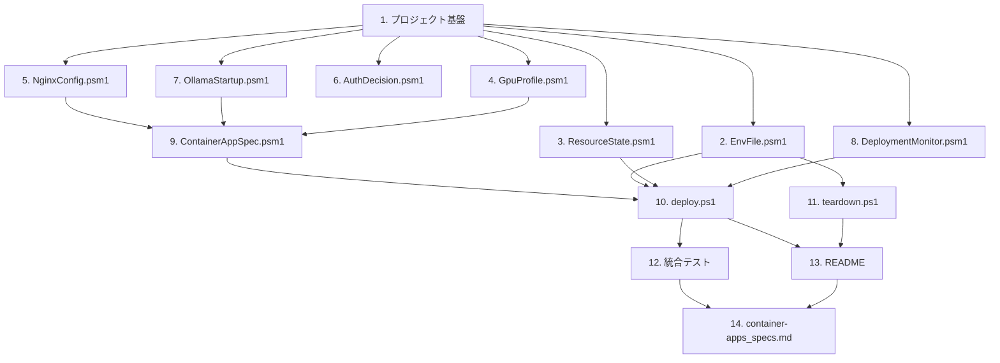

# Implementation Plan

## Overview

Azure Container Apps のサーバーレス GPU 上に Ollama + gpt-oss:20b を APIキー付きでデプロイする一連の自動化を、design.md の設計に基づいて実装する。純粋関数モジュール（`EnvFile`, `ResourceState`, `GpuProfile`, `NginxConfig`, `AuthDecision`, `OllamaStartup`, `DeploymentMonitor`, `ContainerAppSpec`）を先に実装・テストし、それらを組み合わせる`deploy.ps1`/`teardown.ps1`を構築、最後にドキュメントを整備する。各モジュールの実装直後にそのモジュールに対応するproperty-basedテスト（design.mdのCorrectness Properties 1〜14、各最低100イテレーション）を実施する。

## Task Dependency Graph



```json
{
  "waves": [
    { "wave": 1, "tasks": ["1"] },
    { "wave": 2, "tasks": ["2", "3", "4", "5", "6", "7", "8"] },
    { "wave": 3, "tasks": ["9"] },
    { "wave": 4, "tasks": ["10"] },
    { "wave": 5, "tasks": ["11", "12"] },
    { "wave": 6, "tasks": ["13"] },
    { "wave": 7, "tasks": ["14"] }
  ]
}
```

## Tasks

- [x] 1. プロジェクト基盤の作成
  - リポジトリのディレクトリ構成（`modules/`, `tests/`）を作成する
  - `.env.example` を作成し、`AZURE_SUBSCRIPTION_ID`, `AZURE_TENANT_ID`, `AZURE_RESOURCE_GROUP`（既定値 `rg-ollama-gptoss20b`）, `AZURE_LOCATION`（既定値 `westus3`）, `AZURE_CONTAINER_APPS_ENVIRONMENT`（既定値 `cae-ollama-gptoss20b`）, `AZURE_CONTAINER_APP_NAME`（既定値 `ca-ollama-gptoss20b`）, `AZURE_GPU_TYPE`（既定値 `T4`）, `OLLAMA_MODEL`（既定値 `gpt-oss:20b`）, `API_KEY`（空・コメントで自動生成される旨を記載）の各項目を、説明コメント付きで記載する
  - Pesterがインストールされていることを前提としたテスト実行手順（`Invoke-Pester`）をリポジトリ内にメモしておく
  - _Requirements: 1.2_

- [x] 2. `EnvFile.psm1` モジュールの実装とテスト
  - [x] 2.1 `Read-EnvFile`, `Write-EnvFile`, `Test-RequiredKeys`, `New-ApiKey` を実装する
    - `Read-EnvFile`: `KEY=VALUE`形式の行を解析し、コメント行（`#`始まり）・空行を無視し、引用符を除去してhashtableを返す
    - `Write-EnvFile`: hashtableを`.env`形式にシリアライズしてファイルに書き込む
    - `Test-RequiredKeys`: 必須キー一覧から欠落キー名の配列を返す（API_Keyは必須キー一覧に含めない）
    - `New-ApiKey`: 暗号論的乱数（`System.Security.Cryptography`）を用いたランダム英数字文字列を生成する
    - _Requirements: 1.1, 1.4, 1.5_
  - [x] 2.2 具体例・エッジケースの単体テスト（Pester）を作成する
    - コメント行・空行・引用符付き値・末尾スペースを含む`.env`サンプルの解析結果を検証
    - 必須キーが全て揃っている場合に空配列を返すことを検証
    - _Requirements: 1.1, 1.4_
  - [x] 2.3 Property 1（`.env`読み書きのラウンドトリップ）のプロパティテストを実装する
    - ランダムなキー/値ペア集合（キーは英数字とアンダースコアのみ、値は改行を含まない文字列）を100件以上生成し、`Write-EnvFile`→`Read-EnvFile`のラウンドトリップが元の集合と一致することを検証
    - テストコメントに `# Feature: ollama-gpt-oss-container-apps, Property 1` を付与する
    - _Requirements: 1.1_
  - [x] 2.4 Property 2（必須項目欠落検出の完全性）のプロパティテストを実装する
    - 必須キー一覧のランダムな空でない部分集合を欠落させたケースを100件以上生成し、`Test-RequiredKeys`が欠落キーを全て検出することを検証
    - _Requirements: 1.4_
  - [x] 2.5 Property 3（API_Key自動生成の妥当性と一意性）のプロパティテストを実装する
    - ランダムな長さ・複数回呼び出しで`New-ApiKey`の文字種制約と重複無しを100件以上のケースで検証
    - _Requirements: 1.5_

- [x] 3. `ResourceState.psm1` モジュールの実装とテスト
  - [x] 3.1 `Get-ResourceAction`, `Test-RegionGpuSupported` を実装する
    - `Get-ResourceAction`: 存在有無のブール値から`"Reuse"`/`"Create"`を返す
    - `Test-RegionGpuSupported`: `{westus3, swedencentral} × {T4, A100}` の許可リストと照合する
    - _Requirements: 2.2, 2.4, 2.5, 7.1_
  - [x] 3.2 Property 4（リソース存在有無に基づく再利用/作成の決定性）のプロパティテストを実装する
    - ランダムなブール値を100件以上生成し、`Get-ResourceAction`の戻り値を検証
    - _Requirements: 2.2, 7.1_
  - [x] 3.3 Property 5（リージョン×GPU種別の組み合わせ検証の網羅性）のプロパティテストを実装する
    - リージョン文字列（許可リスト内外を含む）とGPU種別文字列のランダムな組み合わせを100件以上生成し、`Test-RegionGpuSupported`の戻り値を許可リストと比較検証
    - _Requirements: 2.4, 2.5_

- [x] 4. `GpuProfile.psm1` モジュールの実装とテスト
  - [x] 4.1 `Get-WorkloadProfile` を実装する
    - `T4` → `Consumption-GPU-NC8as-T4`（8 vCPU/56 GiB）、`A100` → `Consumption-GPU-NC24-A100`（24 vCPU/220 GiB）のマッピングを返す
    - _Requirements: 3.2_
  - [x] 4.2 Property 7（GPU種別からワークロードプロファイルへのマッピングの正しさ）のプロパティテストを実装する
    - `T4`/`A100`のランダムな選択を100件以上生成し、対応する固定のプロファイルタイプと正のリソース上限が返ることを検証
    - _Requirements: 3.2_

- [x] 5. `NginxConfig.psm1` モジュールの実装とテスト
  - [x] 5.1 `New-NginxConfigScript` を実装する
    - APIキーをヒアドキュメントでリテラル埋め込みしたnginx.confを生成し、`nginx -g "daemon off;"`を実行する起動シェルスクリプト文字列を返す
    - ヘッダー欠落時・不一致時は401、一致時は`http://localhost:11434`へ`proxy_pass`するロジックを含める
    - _Requirements: 4.1, 4.2, 4.3_
  - [x] 5.2 Property 8（nginx設定生成におけるAPIキー照合ロジックの包含）のプロパティテストを実装する
    - 空文字列を除くランダムなAPIキー文字列を100件以上生成し、生成された起動スクリプトにそのAPIキー値を用いた完全一致比較ロジックが含まれることを検証
    - _Requirements: 4.2_

- [x] 6. `AuthDecision.psm1` モジュールの実装とテスト
  - [x] 6.1 `Test-ApiKeyAuthorized` を実装する
    - ヘッダー値が`$null`または空文字列なら`$false`、設定済みキーと完全一致する場合のみ`$true`を返す
    - _Requirements: 4.4, 4.5, 4.6_
  - [x] 6.2 Property 9（APIキー認可判定の正しさ）のプロパティテストを実装する
    - ヘッダー値（`$null`、空文字列、任意の文字列）と設定済みAPIキーのランダムな組み合わせを100件以上生成し、欠落時・不一致時は`$false`、完全一致時のみ`$true`を返すことを検証
    - _Requirements: 4.4, 4.5, 4.6_

- [x] 7. `OllamaStartup.psm1` モジュールの実装とテスト
  - [x] 7.1 `New-OllamaStartupScript` を実装する
    - `ollama serve`をバックグラウンド起動し、ヘルスチェックループ後に`ollama pull "$OLLAMA_MODEL"`（失敗時`exit 1`）→`ollama run "$OLLAMA_MODEL"`を順に実行する起動スクリプト文字列を生成する
    - _Requirements: 5.1, 5.2, 5.3, 5.4_
  - [x] 7.2 Property 10（Ollama起動スクリプトにおけるモデル名の一致とコマンド順序）のプロパティテストを実装する
    - ランダムなモデル名文字列を100件以上生成し、`pull`と`run`の対象が同一モデル名であり`pull`が`run`より先に出現することを検証
    - _Requirements: 5.1, 5.2, 5.4_

- [x] 8. `DeploymentMonitor.psm1` モジュールの実装とテスト
  - [x] 8.1 `Get-ModelReadinessResult`, `Write-DeploymentResult` を実装する
    - `Get-ModelReadinessResult`: 状態文字列が`"Failed"`/`"Timeout"`のとき`"Error"`を返す
    - `Write-DeploymentResult`: `$IsComplete`が`$true`の場合のみcurl実行例を出力し、Public_EndpointのURL自体は別ステップで常に出力する
    - _Requirements: 3.5, 5.3, 6.1, 6.2_
  - [x] 8.2 Property 11（モデル準備状態判定の正しさ）のプロパティテストを実装する
    - `"Succeeded"`, `"Failed"`, `"Timeout"`, `"Pulling"`等のランダムな状態文字列を100件以上生成し、`"Failed"`/`"Timeout"`のとき常に`"Error"`を返すことを検証
    - _Requirements: 5.3_
  - [x] 8.3 Property 12（デプロイ完了フラグに基づく出力タイミングの一貫性）のプロパティテストを実装する
    - ランダムなブール値を100件以上生成し、`$false`のとき常にcurl実行例が出力されず、`$true`のとき常に出力されることを検証
    - _Requirements: 6.2_

- [x] 9. `ContainerAppSpec.psm1` モジュールの実装とテスト
  - [x] 9.1 `New-ContainerAppYaml` を実装する
    - `.env`設定値からOllama_Container（先頭定義、`docker.io/ollama/ollama:latest`）とAuth_Proxy_Container（`nginx:alpine`）の2コンテナ、`external: true`かつ`targetPort: 8080`のイングレス、GPUマッピングによる`workloadProfileName`を含むYAML文字列を生成する
    - Ollama_Containerの起動コマンドには`OllamaStartup.psm1`の出力、Auth_Proxy_Containerの起動コマンドには`NginxConfig.psm1`の出力を埋め込む
    - _Requirements: 3.1, 3.2, 3.3, 4.1, 4.3_
  - [x] 9.2 Property 6（Container AppスペックYAMLの必須構成要素）のプロパティテストを実装する
    - 有効な設定値（モデル名、GPU種別、APIキー）のランダムな組み合わせを100件以上生成し、生成YAMLが常に(a)Ollamaイメージのコンテナ定義、(b)nginxイメージのコンテナ定義、(c)`external: true`かつ`targetPort: 8080`のイングレス設定を含むことを検証
    - _Requirements: 3.1, 3.2, 3.3, 4.1, 4.3_
  - [x] 9.3 単体テストとしてYAML構文妥当性を検証する
    - 生成されたYAML文字列がYAMLパーサーで正しくパースできることを検証
    - _Requirements: 3.1, 3.2, 3.3, 4.1, 4.3_

- [x] 10. `deploy.ps1` の実装
  - [x] 10.1 認証確認とサブスクリプション切替のロジックを実装する
    - `az account show`で未ログインを検出し、失敗時はエラーメッセージを表示して中断する
    - 現在のサブスクリプションIDと`.env`の値を比較し、不一致なら確認なしで`az account set --subscription`を実行する（Property 14の判定ロジックをここで利用）
    - _Requirements: 7.3, 7.4_
  - [x] 10.2 Property 14（サブスクリプション自動切替の条件一致性）のプロパティテストを実装する
    - ランダムな2つのサブスクリプションID文字列の組み合わせを100件以上生成し、不一致時のみ切替が必要と判定されることを検証
    - _Requirements: 7.4_
  - [x] 10.3 `.env`読込・検証・API_Key自動生成の呼び出しを`deploy.ps1`に統合する
    - `EnvFile.psm1`の関数を呼び出し、必須項目欠落時はエラー表示して中断、API_Key未設定時は自動生成して`.env`へ書き込む
    - _Requirements: 1.1, 1.3, 1.4, 1.5_
  - [x] 10.4 Resource_Group作成/再利用のロジックを実装する
    - `az group create`を実行する（Azure CLI自体が冪等なため既存時も成功する）
    - _Requirements: 2.1, 2.2_
  - [x] 10.5 リージョン×GPU_Type検証とContainer_Apps_Environment作成/再利用のロジックを実装する
    - `Test-RegionGpuSupported`で非対応時はエラー表示して中断
    - `az containerapp env show`で存在確認し、なければ`az containerapp env create`
    - `az containerapp env workload-profile add`でGPUワークロードプロファイルを追加（既存時は再利用）
    - _Requirements: 2.3, 2.4, 2.5_
  - [x] 10.6 Container_App作成/更新のロジックを実装する
    - `ContainerAppSpec.psm1`でYAMLを生成し、`az containerapp show`で存在確認後、`az containerapp create --yaml`または`az containerapp update --yaml`を実行する
    - `update`失敗時はエラーをログに記録し、後続手順（Public_Endpoint表示等）を継続する（Property 13の判定ロジックをここで利用）
    - _Requirements: 3.1, 3.2, 3.3, 3.4, 4.1, 4.2, 4.3, 7.2_
  - [x] 10.7 Property 13（Container_App更新失敗時の後続処理継続性）のプロパティテストを実装する
    - ランダムなブール値（更新成功/失敗）を100件以上生成し、値に関わらず常に後続処理が実行される判定になることを検証
    - _Requirements: 7.2_
  - [x] 10.8 Public_Endpoint表示とモデル準備確認・完了時の出力を実装する
    - `az containerapp show --query properties.configuration.ingress.fqdn`でURLを取得し、GPU割当や後続手順の成否に関わらず表示する
    - `az containerapp logs show`をポーリングして`DeploymentMonitor.psm1`の`Get-ModelReadinessResult`でモデル準備状態を判定し、失敗/タイムアウト時はエラー表示して中断する
    - 成功時、`Write-DeploymentResult`でcurl実行例を表示する
    - _Requirements: 3.5, 5.1, 5.2, 5.3, 5.4, 6.1, 6.2_

- [x] 11. `teardown.ps1` の実装
  - [x] 11.1 削除確認プロンプトとリソースグループ削除ロジックを実装する
    - `.env`から`AZURE_RESOURCE_GROUP`を読み込み、`-Force`スイッチ未指定時は`Read-Host`で確認入力を要求する
    - `az group delete --name <rg> --yes --no-wait`を実行し、失敗時は再試行せず失敗内容を表示して終了する
    - _Requirements: 8.1, 8.2, 8.3_
  - [x] 11.2 単体テストで確認プロンプトの具体例を検証する
    - `-Force`指定時にプロンプトが表示されないこと、未指定時に表示されることを検証
    - _Requirements: 8.3_

- [x] 12. モックを用いた統合テスト
  - `az`コマンドをPesterの`Mock`機能でスタブ化し、`deploy.ps1`全体のリソース作成順序（Resource_Group→Container_Apps_Environment→ワークロードプロファイル→Container_App→Public_Endpoint表示）と、既存リソース再利用時に作成コマンドがスキップされる動作を検証する
  - _Requirements: 2.1, 2.2, 2.3, 7.1_

- [x] 13. README.md / README.ja-JP.md の作成
  - [x] 13.1 英語版 `README.md` を作成する
    - 事前準備セクションに、対話型`az login`を実行者が事前に一度実行しておく必要があること、`deploy.ps1`がログイン処理を代行しないこと、未ログイン時はエラーで中断することを明記する
    - `.env.example`を`.env`にコピーして値を編集する手順を事前準備の一部として記載する
    - `deploy.ps1`/`teardown.ps1`の実行手順、curl呼び出し例を記載する
    - _Requirements: 9.1, 9.2, 9.3, 9.4_
  - [x] 13.2 日本語版 `README.ja-JP.md` を作成する
    - README.mdと同一の内容（事前準備・利用手順・クリーンアップ手順）を日本語で記載する
    - _Requirements: 9.1, 9.5_

- [x] 14. `container-apps_specs.md` への仕様まとめの反映
  - requirements.md / design.md の主要仕様（構成概要、.envパラメータ一覧、GPU/リージョン対応表、デプロイフロー、APIキー認証方式、クリーンアップ手順）を`container-apps_specs.md`に要約として記載する
  - _Requirements: 1.1, 1.2, 2.5, 3.2, 4.1_

## Notes

- 各タスクの `_Requirements:_` はrequirements.mdの要件番号（例: `1.1`はRequirement 1のAcceptance Criteria 1）に対応する。
- プロパティテストはPester + `Get-Random`ベースの自作ジェネレータで実装し、各テストコメントに `# Feature: ollama-gpt-oss-container-apps, Property {number}` を付与して design.md のCorrectness Propertiesと対応付ける。
- 実際のAzure環境への手動デプロイ確認（curl実行例の実行）は自動テストの対象外とし、README記載の手順で利用者が検証する。
