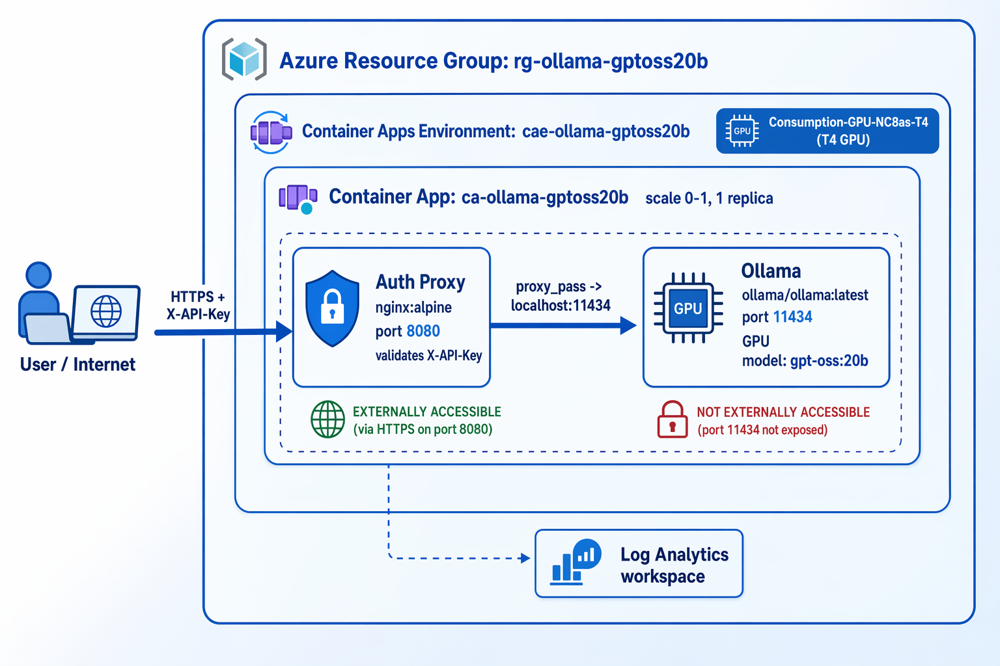

# Manual deployment via the Azure portal (equivalent of `deploy.ps1`)

This document walks through creating the **same setup** that `deploy.ps1` provisions with the Azure CLI, but manually from the Azure portal (GUI). Use it when you want to understand the architecture, or build it step by step in the UI.

For the overall picture, see the architecture diagram below:



> **Which should you use?** Entering the startup commands (multi-line shell scripts) is more reliable with `deploy.ps1` (or the `az` CLI) than in the portal. The portal is best for learning and inspection; prefer `deploy.ps1` for production or repeated use.

---

## Resources created (identical to `deploy.ps1`)

| Resource | Name (default) | Notes |
|---|---|---|
| Resource group | `rg-ollama-gptoss20b` | |
| Container Apps environment | `cae-ollama-gptoss20b` | Workload profiles environment |
| GPU workload profile | `Consumption-GPU-NC8as-T4` | T4 (8 vCPU / 56 GiB). A100 is `Consumption-GPU-NC24-A100` |
| Container App | `ca-ollama-gptoss20b` | Two containers in one replica |
| └ Container 1 (GPU) | `ollama` | `docker.io/ollama/ollama:latest`, port 11434 |
| └ Container 2 (sidecar) | `auth-proxy` | `nginx:alpine`, port 8080, API-key validation |
| Secret | `api-key` | Holds the API key value |

- **Region**: `West US 3` (westus3) or `Sweden Central` (swedencentral). Both support T4 / A100.
- **Ingress**: external, target port **8080** (= auth-proxy). Ollama's 11434 is not exposed directly.
- **Scale**: min replicas **0** / max replicas **1** (scales to zero when idle).

---

## Prerequisites

1. An Azure subscription with resource-creation rights (e.g. Contributor).
2. **Serverless GPU quota.** Depending on the subscription, you may need to request T4/A100 quota. If short, request an increase under "Usage + quotas".
3. Use a supported region (West US 3 / Sweden Central).
4. Decide on an **API key string** in advance (e.g. a random 32-char alphanumeric string). `deploy.ps1` auto-generates one; for manual portal creation you provide it yourself.

---

## Steps

### Step 1. Create the resource group

1. From the portal search, go to "Resource groups" → "Create".
2. **Resource group name**: `rg-ollama-gptoss20b`
3. **Region**: `West US 3` (or `Sweden Central`)
4. "Review + create" → "Create".

### Step 2. Create the Container Apps environment

1. From search, go to "Container Apps" → "Create".
2. "Basics" tab:
   - **Resource group**: `rg-ollama-gptoss20b`
   - **Container app name**: `ca-ollama-gptoss20b` for now (creating the app also lets you create the environment; you'll edit the app later)
   - **Region**: `West US 3`
3. Under "Container Apps environment", choose "Create new":
   - **Environment name**: `cae-ollama-gptoss20b`
   - **Environment type**: **Workload profiles** (required for GPU; the Consumption-only environment does not support GPU/ExpressRoute)
   - A Log Analytics workspace can be auto-created
4. Don't click "Create" yet — add the GPU profile in Step 3 (it can also be added after the environment exists).

> If you already created the environment, Step 3 can be done afterward from the environment's "Workload profiles" page.

### Step 3. Add the GPU workload profile

1. Open the Container Apps **environment** (`cae-ollama-gptoss20b`) → "**Workload profiles**".
2. "Add" a new profile:
   - **Name**: `Consumption-GPU-NC8as-T4`
   - **Type**: a GPU Consumption profile (`NC8as-T4` = T4)
   - Note: because this is a Consumption profile, node count (min/max) is not needed / not supported.
3. Save.

### Step 4. Configure the Container App

Open the Container App (`ca-ollama-gptoss20b`), go to "**Revisions and replicas**" → "Create new revision" and configure the following (the create wizard is equivalent).

#### 4-1. Register the secret

1. In the app, go to "Settings" → "Secrets" → "Add".
2. **Key**: `api-key` / **Value**: the API key string you prepared.

#### 4-2. Container 1: Ollama (**must be defined first**)

> **Important**: The GPU is assigned to the **first** container defined in the Container App. **Define Ollama as container #1.**

- **Name**: `ollama`
- **Image source**: Docker Hub etc. → **Image**: `docker.io/ollama/ollama:latest`
- **Workload profile**: `Consumption-GPU-NC8as-T4` (GPU)
- **CPU / memory**: 7.5 vCPU / 55 Gi (profile max 8/56 minus the 0.5/1 reserved for auth-proxy)
- **Environment variable**: `OLLAMA_MODEL` = `gpt-oss:20b`
- **Command override**: `sh,-c` (command = `sh`, first arg = `-c`)
- **Arguments override**: paste the "Ollama startup script" below as a **single argument**

#### 4-3. Container 2: auth-proxy (nginx sidecar)

- **Name**: `auth-proxy`
- **Image**: `nginx:alpine`
- **CPU / memory**: 0.5 vCPU / 1 Gi
- **Environment variable**: `API_KEY` = secret reference (`api-key`)
- **Command override**: `sh,-c`
- **Arguments override**: paste the "nginx startup script" below as a **single argument** (replace `__API_KEY__` with the actual API key value)

> **Pitfall (double `sh -c` nesting)**: Since the command is `sh -c`, the argument script must **not** itself wrap in `sh -c '...'` (paste the body only). Double-wrapping causes the container to crash-loop.

#### 4-4. Ingress

1. "Ingress" → **Enabled**.
2. **Traffic**: "Accepting traffic from anywhere" (external).
3. **Target port**: **8080** (the auth-proxy port, not 11434).

#### 4-5. Scale

- **Min replicas**: `0`
- **Max replicas**: `1`

Create / apply the revision.

### Step 5. Verify model loading

- On Ollama container startup, `ollama pull gpt-oss:20b` → `ollama run` runs automatically (a ~13 GB download, so it takes several minutes).
- Under "Revisions and replicas", confirm the replica's **running state** becomes healthy (Running), or check "Logs" for errors.
- If `ollama pull` fails, the replica restarts repeatedly and the status becomes `Failed`/`Degraded`.

### Step 6. Get the endpoint and test

1. Note the **Application URL** on the app's "Overview" (`https://<app>.<region>.azurecontainerapps.io`).
2. From Windows PowerShell (use **`curl.exe`**, not the `curl` alias; escape JSON `"` as `\"`):

```powershell
curl.exe -X POST "https://<app>.<region>.azurecontainerapps.io/api/generate" -H "X-API-Key: <YOUR_API_KEY>" -H "Content-Type: application/json" -d '{\"model\":\"gpt-oss:20b\",\"prompt\":\"Hello\",\"stream\":false}'
```

A request with a missing/mismatched API key gets a `401` from the auth-proxy and is never forwarded to Ollama.

---

## Copy-paste: startup scripts (paste as the arguments override body)

### Ollama startup script (container 1 argument)

```sh
ollama serve &
until ollama list >/dev/null 2>&1; do sleep 2; done
ollama pull "gpt-oss:20b" || exit 1
echo "" | ollama run "gpt-oss:20b" >/tmp/ollama-run.log 2>&1
wait
```

> **Health check note**: The official `ollama/ollama` image does **not** include `curl`. A `curl`-based health check fails with "command not found", so `ollama list` is used instead.
> To use a different model, set the `OLLAMA_MODEL` env var and change both occurrences of `"gpt-oss:20b"` in this script to the same name.

### nginx startup script (container 2 argument; replace `__API_KEY__` with the real key)

```sh
cat <<'EOF' > /etc/nginx/conf.d/default.conf
server {
    listen 8080;
    location / {
        if ($http_x_api_key = "") { return 401; }
        if ($http_x_api_key != "__API_KEY__") { return 401; }
        proxy_pass http://localhost:11434;
        proxy_set_header Host $host;
    }
}
EOF
nginx -g "daemon off;"
```

> Using a quoted heredoc terminator (`<<'EOF'`) prevents the shell from expanding `$http_x_api_key` / `$host` (nginx variables), so they are written as literals for nginx to interpret.

---

## Pitfalls (discovered through real-world testing)

- **GPU is assigned to the first container** → define Ollama as container #1.
- **`curl` is not bundled** → use `ollama list` for the Ollama health check.
- **Avoid double `sh -c` nesting** → command = `sh,-c`, argument = script **body only**.
- **Target port is 8080** (auth-proxy). Do not expose 11434.
- **Region/GPU** is limited to West US 3 / Sweden Central × T4 / A100 in this project.
- **Line endings**: When typing directly in the portal you generally needn't worry about LF/CRLF, but if you copy from a CRLF source, stray `\r` can leak into commands inside the Linux container. If startup misbehaves, suspect line endings (`deploy.ps1` normalizes to LF).
- **Cost**: `Consumption-GPU-*` is billed only for active seconds (billing stops when scaled to zero while idle). See the "Billing" section of [README.md](../README.md).

---

## Changing the model

Change the `OLLAMA_MODEL` env var and the model name in the Ollama startup script to run a different model (within the GPU's VRAM). For example models and VRAM guidance, see the "Choosing the model" section of [README.md](../README.md), or [.env.example](../.env.example).

---

## Mapping to `deploy.ps1`

| Step in this guide | Corresponding `deploy.ps1` logic |
|---|---|
| Step 1 resource group | `az group create` (`Initialize-ResourceGroup`) |
| Step 2 environment | `az containerapp env create` (`Initialize-ContainerAppsEnvironment`) |
| Step 3 GPU profile | `az containerapp env workload-profile add` (`Add-GpuWorkloadProfile`) |
| Step 4 app config | `az rest --method PUT` (`Publish-ContainerApp` + `New-ContainerAppSpec`) |
| startup scripts | `OllamaStartup.psm1` / `NginxConfig.psm1` |
| Step 5 model check | `properties.runningStatus` polling (`Wait-ForModelReady`) |
| Step 6 endpoint | `properties.configuration.ingress.fqdn` (`Get-PublicEndpointUrl`) |

For the full automated flow and design details, see [.kiro/specs/ollama-gpt-oss-container-apps/design.md](../.kiro/specs/ollama-gpt-oss-container-apps/design.md).

---

*日本語版は [portal-deployment.ja-JP.md](portal-deployment.ja-JP.md) を参照してください。*
